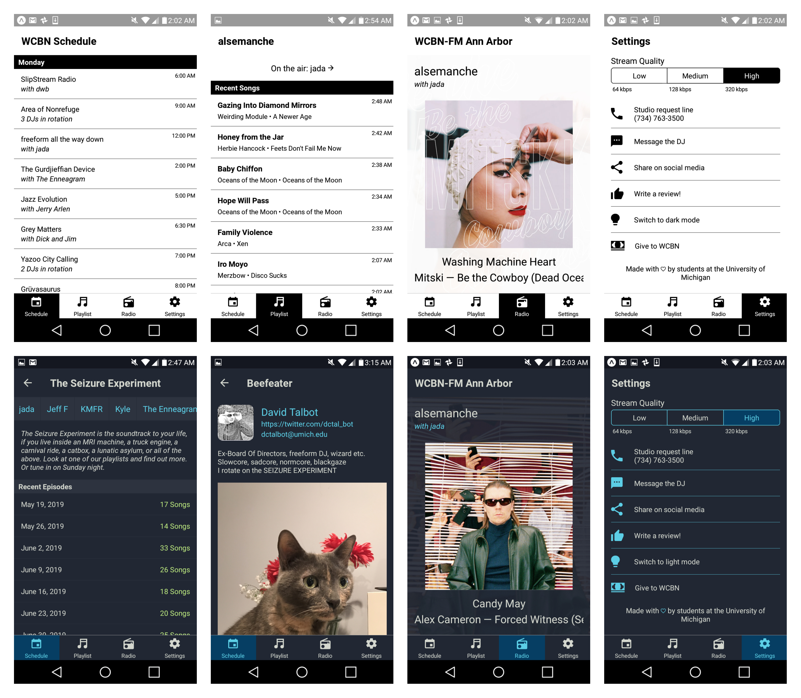

# React-Native Selective member station App for Android and iOS

┏┓   
┃┃╱╲ &nbsp; in this 
┃╱╱╲╲  &nbsp; house 
╱╱╭╮╲╲ &nbsp; we  
▔▏┗┛▕▔ 
╱▔▔▔▔▔▔▔▔▔▔╲   
&nbsp;&nbsp;&nbsp; default to dark mode 🌚 
╱╱┏┳┓╭╮┏┳┓ ╲╲  
▔▏┗┻┛┃┃┗┻┛▕▔ 

# Demo

[View with the Expo app](https://expo.io/@derekacosta/wcbn-app)

# Things you'll need

- yarn
- Expo app / account
- iOS / Android Studio Emulators (optional)
